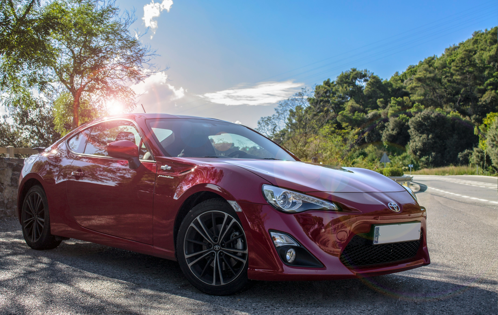

# Car Quest

A simple, static web project that showcases luxury cars with a clean landing (login) page, a hero-style home page, a curated “Today’s Latest” section, an image gallery, and essential informational pages (Contact, Privacy Policy, Terms and Conditions). Built with HTML5 and CSS3—no JavaScript framework required.

> Current branch: `portfolio` • Repository: `Car-Quest`

## Table of contents

- Project overview
- Features
- Project structure
- Pages overview
- Styling and assets
- Local development
- Deployment (GitHub Pages)
- Accessibility and SEO notes
- Credits
- Roadmap / next steps

## Project overview

Car Quest is a static website intended for learning and portfolio purposes. It provides a polished, multi-page experience:

- A video-backed landing page that routes to the site’s home.
- A responsive navigation bar used consistently across main pages.
- A hero section with a call to action.
- A visual gallery with car attributes.
- Informational content for privacy policy and terms.
- A styled contact form (non-functional by design in this repo).

Tech stack:

- HTML5
- CSS3 (hand-written, page-scoped stylesheets)

There’s no build step and no external runtime dependencies. You can open the site directly in a browser or serve it via any static web server.

## Features

- Video background landing page (`index.html`) with an email/password form that redirects to the site (no auth back end).
- Responsive navigation (hamburger toggle pattern) shared across core pages.
- Hero section with imagery and clear CTA to “Today’s Latest.”
- Gallery page with cards, images, and basic metadata (horsepower, maker, etc.).
- Contact page with styled form inputs (action is a self-post; no back end).
- Dedicated Privacy Policy and Terms and Conditions pages.
- Favicon set and social icons available for future use.

## Project structure

Repository layout at a glance:

```
.
├─ index.html
├─ assets/
│  ├─ css/
│  │  ├─ contact.css
│  │  ├─ footer.css
│  │  ├─ gallery.css
│  │  ├─ home.css
│  │  ├─ index.css
│  │  ├─ navbar.css
│  │  ├─ privacy-policy.css
│  │  ├─ terms-and-conditions.css
│  │  └─ todays-latest.css
│  ├─ favicons/
│  │  ├─ icons8-facebook.svg
│  │  ├─ icons8-github.svg
│  │  ├─ icons8-linkedin.svg
│  │  ├─ icons8-twitter.svg
│  │  ├─ privacy-policy1.PNG
│  │  ├─ privacy-policy2.PNG
│  │  ├─ privacy-policy3.PNG
│  │  ├─ privacy-policy4.PNG
│  │  └─ websiteLogo.png
│  ├─ images/
│  │  ├─ BMWLogo.jpg
│  │  ├─ LamborghiniLogo.jpg
│  │  ├─ contactUs.jpg
│  │  ├─ galleryImage1.jpg
│  │  ├─ galleryImage2.jpg
│  │  ├─ galleryImage3.jpg
│  │  ├─ galleryImage4.jpg
│  │  └─ homePage.jpg
│  └─ videos/
│     └─ loginPageVideo.mp4
└─ home/
   ├─ contact.html
   ├─ gallery.html
   ├─ home.html
   ├─ privacy-policy.html
   ├─ terms-and-conditions.html
   └─ todays-latest.html
```

## Pages overview

- `index.html` — Landing/Login screen with looping background video. The form posts to `home/home.html` (purely navigational; no real authentication logic).
- `home/home.html` — Home page with:
  - Responsive navbar (`assets/css/navbar.css` + `assets/css/footer.css`)
  - Full-bleed image hero (`assets/images/homePage.jpg`)
  - CTA to Today’s Latest
- `home/todays-latest.html` — Rich text and imagery highlighting brands (e.g., Lamborghini), using `todays-latest.css`.
- `home/gallery.html` — Image gallery with cards, each linking to a full-size image. Styled via `gallery.css`.
- `home/contact.html` — Contact form layout with `contact.css`. The form’s `action` points back to the same page; there’s no server back end.
- `home/privacy-policy.html` — Privacy policy content styled with `privacy-policy.css`.
- `home/terms-and-conditions.html` — Terms and conditions content styled with `terms-and-conditions.css`.

Navigation links within the navbar point to: Home, Today’s Latest, Gallery, and Contact Us.

## Styling and assets

- Stylesheets
  - Page-scoped CSS loaded per page to minimize unused styles.
  - Shared sections include `navbar.css` and `footer.css`.
- Media
  - Background video: `assets/videos/loginPageVideo.mp4` used on the landing page.
  - Images: gallery cards, brand logos, and page hero images under `assets/images/`.
  - Favicons and Social icons: under `assets/favicons/` (SVGs and PNGs).

Example hero used on the home page:



## Local development

This is a static site; you can open files directly in a browser or serve them with a simple static server to avoid CORS issues for media on some browsers.

- Option 1: Open `index.html` directly in your browser.
- Option 2: Serve the repository root with a lightweight HTTP server, then browse to `http://localhost:8000/`.

```bash
# From the repository root
python -m http.server 8000
# Then open: http://localhost:8000/
```

If you use VS Code, the “Live Server” extension is convenient for automatic reloads.

## Deployment (GitHub Pages)

You can deploy this static site with GitHub Pages in a few clicks:

1. Commit and push all changes to the `portfolio` branch (or `main`/`gh-pages`).
2. In GitHub: Settings → Pages → Build and deployment
3. Set Source to “Deploy from a branch” and select the branch and root folder `/`.
4. Save. Your site will be available at: `https://ijazabdullah127.github.io/Car-Quest/`.

If using a custom domain, configure a CNAME in your repository settings and your DNS provider.

## Accessibility and SEO notes

- Provide meaningful `alt` text for all images (many already have alt text; review gallery images).
- Ensure sufficient color contrast in text over images and video.
- Use descriptive link text instead of generic “click here.”
- Add basic SEO meta tags (title, description, social preview) if publishing.

## Credits

- Background video on landing page (index): https://www.youtube.com/watch?v=NMThdHhrLoM
- Social icons are from Icons8 (e.g., `assets/favicons/icons8-*.svg`).
- Brand logos (e.g., BMW, Lamborghini) are trademarks of their respective owners and are used here for educational/demo purposes only.

If you own any of the referenced assets and would like attribution updated or assets removed, please open an issue.

## Roadmap / next steps

- Optional: Add JavaScript for basic form validation on the landing and contact pages.
- Optional: Bundle shared styles and introduce a design token layer (colors, spacing, typography).
- Optional: Add a simple back-end or a form handler service (e.g., Formspree) for the contact form.
- Optional: Add unit tests for any future JavaScript enhancements and a minimal CI workflow.

---

<<<<<<< Updated upstream
If you have feedback or want to contribute improvements, feel free to open an issue or a pull request.
=======
If you have feedback or want to contribute improvements, feel free to open an issue or a pull request. Don't forget to star this repo.
>>>>>>> Stashed changes
Co-authored-by: ijazabdullah127 ijaz.abdullah127@gmail.com
Co-authored-by: abdullahijaz786 l2111860@lhr.nu.edu.pk